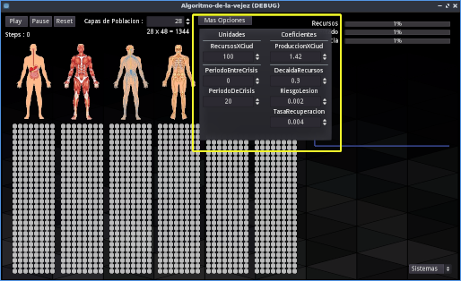

# algoritmo-envejecimiento

(Este es un proyecto de [Godot Game Engine](https://godotengine.org/), se puede editar, exportar o ejecutar usando ese engine)

El objetivo de este programa es experimentar una teoria sobre el funcionamiento del envejecimiento tanto a nivel celular como 
en otros escenarios de la naturaleza y a diferentes escalas. Entendiendo mejor el proceso podrán encontrarse puntos criticos para modificarlo.

La idea es que el proceso de envejecimiento actua a modo de cuenta atras, y para crear una cuenta atras normalmente hace falta una unidad de memoria temporal, como un contador.

Cuando se habla de envejecimiento se suele creer que hay una cierta información celular en el ADN que va modificandose segun 
pasan los dias de vida y que las cosas van dejando de funcionar gradualmente.
El problema es que, de ser así, por estadistica, entre la infinidad de seres vivos que habitan la tierra podriamos encontrar 
casos de deformación o enfermedad genetica donde el resultado fuese la ausencia de envejecimiento, pero no es asi. (Se encuentran enfermedades geneticas que
aceleran el proceso de envejecimiento)

Es por ello que ese proceso regresivo cosidero que debe ser algo mas infalible que lo transmitible mediante información genetica.
Por ese motivo he desarrollado un algoritmo que se manifiesta como una cuenta regresiva en el funcionamiento optimo de unidades que comparten recursos entre si
y donde el resultado es un proceso que va desde un punto optimo y eficiente hasta un colapso final o muerte sin usar memoria a nivel 
temporal, solo un puñado de unidades o celulas o individuos interactuando entre si.

## en que consiste el algoritmo

Contamos con un conjunto de unidades, pueden ser celulas, sistemas o individuos segun la escala a la que queramos hacer referencia.
(El funcionamiento del algoritmo es el mismo para todas ellas, solo cambia el aspecto visual)

El algoritmo funciona de forma reiterativa en un loop.

Al principio del loop se les asigna una eficiencia del 100% a todas las unidades.

En cada iteración del loop, se seleccionan todas las unidades en orden aleatorio.

Cada vez que se selecciona una unidad esta hace el siguiente proceso:
- Come la cantidad de colecta standar por unidad si hay (si come esta cantidad puede recuperar eficiencia progresivamente)
- Si no hay la cantidad de colecta standar esta unidad perderá eficiencia en proporción a la cantidad que no ha comido.

- Colecta todo lo que su eficiencia le dicta si hay recursos suficientes (hay un riesgo de lesión a mayor esfuerzo que afecta a la eficiencia)

En cada iteración se acumula la colecta recogida para alimentar al conjunto en la siguiente iteración.

La cantidad de recursos puede variar segun los parametros, habiendo tiempos de crisis en los que hay menos recursos, por ende habra menos colecta y 
como consecuencia en la siguiente iteración habrán unidades que no puedan comer por completo y se verá afectada su eficiencia.

El resultado es un proceso de desgaste bastante complejo de la eficiencia.

## parametros modificables

##### recursosXCiud 
La cantidad de recursos que apareceran por cada ciudadano en cada iteración del loop
##### produccionXCiud
Que coeficiente de producción maximo tendrá cada ciudadano, ej valor 2 es que produce el doble de lo que consume
##### periodoEntreCrisis
Entre crisis y crisis habrá un periodo de recursos al maximo, que durará las iteraciones que se marquen en este valor
##### decaidaRecursos
En el punto mas bajo de la crisis, los recuros decaerán tanto como este coeficiente
##### periodoDeCrisis
Cuanto dura el periodo de cada crisis
##### riesgoLesion
El coeficiente de riesgo de lesión que sufrirá cada unidad cuando realiza la colecta
##### tasaRecuperacion
La tasa de recuperación en cada iteracion cuando la unidad ha comido al maximo. A mas eficiencia de la unidad, mayor recuperación.

